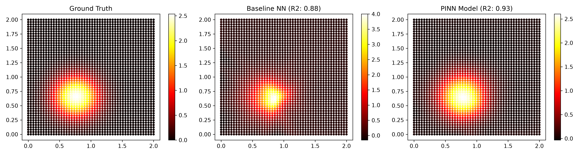

# AeroGraph-PINN: Physics-Informed Neural Networks for Spatio-Temporal Atmospheric Pollution Modeling

AeroGraph-PINN leverages Physics-Informed Neural Networks (PINNs) to reconstruct and forecast 2D spatio-temporal atmospheric pollutant dispersion from ultra-sparse physical sensor networks. By embedding 2D Advection-Diffusion partial differential equations (PDEs) directly into the neural loss function, the model accurately interpolates pollutant concentrations across unmonitored spatial domains without overfitting.

---

## Key Performance Benchmarks

Evaluated across a $50,000$ spatial-temporal point domain using only **200 sparse sensor observations** for training:

| Model Architecture | Loss Constraint | Mean Squared Error (MSE) | $R^2$ Score |
| :--- | :--- | :--- | :--- |
| **Baseline Neural Network** | Pure Data (Sensor MSE) | $0.053317$ | $0.8772$ |
| **AeroGraph-PINN (Ours)** | Data + PDE Residual Loss | **$0.031533$** | **$0.9274$** |

*The PINN architecture achieves a **40.8% reduction in MSE** and superior physical fidelity in unmonitored domain gaps.*

---

## Governing Equations

The atmospheric pollutant dispersion $C(x, y, t)$ is modeled by the 2D Advection-Diffusion equation:

$$\frac{\partial C}{\partial t} + u \frac{\partial C}{\partial x} + v \frac{\partial C}{\partial y} = D \left( \frac{\partial^2 C}{\partial x^2} + \frac{\partial^2 C}{\partial y^2} \right)$$

Where:
* $u, v$: Wind velocity field components ($u = 0.5 \text{ km/h}, v = 0.3 \text{ km/h}$)
* $D$: Atmospheric diffusion coefficient ($D = 0.05$)
* $C(x, y, t)$: Pollutant concentration field

---

## Visual Comparison



* **Ground Truth:** Exact analytical dispersion profile.
* **Baseline NN:** Shows unphysical artifacts and magnitude overestimation ($>4.0$) in sparse zones.
* **PINN Model:** Accurately constrains concentration peak ($2.5$) and spatial boundary profiles.

---

## Repository Structure

```text
AeroGraph-PINN/
├── data/
│   └── pollution_dataset.csv     # Synthetic ground truth spatio-temporal grid
├── models/
│   ├── baseline_model.pt         # Saved standard MLP weights
│   └── pinn_model.pt             # Saved PINN weights
├── paper/
│   └── main.tex                  # Formal IEEE research manuscript
├── scripts/
│   ├── model.py                  # PyTorch PollutionPINN model class
│   ├── generate_data.py          # Advection-diffusion analytical solver
│   ├── train.py                  # Dual-model training routine
│   ├── evaluate.py               # Benchmark matrix & comparison plotter
│   └── plot_data.py              # Single snapshot visualizer
├── comparison_results.png        # Benchmark comparison visualization
├── pollution_map.png             # Initial dataset visualization
└── requirements.txt              # Environment dependencies

```

---

## Quickstart

1. **Clone the repository:**
```bash
git clone [https://github.com/asthaap5347/AeroGraph-PINN.git](https://github.com/asthaap5347/AeroGraph-PINN.git)
cd AeroGraph-PINN

```


2. **Install dependencies:**
```bash
pip install -r requirements.txt

```


3. **Train models:**
```bash
python scripts/train.py

```


4. **Evaluate performance and plot results:**
```bash
python scripts/evaluate.py

```
```
